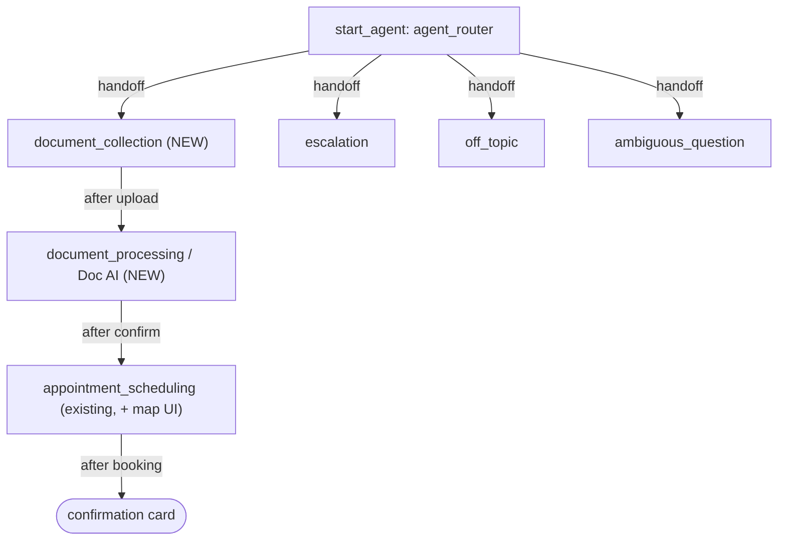

# Agent Spec — Drivers License Agent (converted from DMV Appointment Assisting Agent)

## Purpose & Scope
Customer-facing service agent on a JavaScript Experience Cloud site. Guides a
user through renewing/obtaining a driver license end to end:
1. Collect identity + proof-of-address documents (in-chat upload UI).
2. Use Doc AI to read the docs, extract personal details, update the Contact,
   and confirm with the user.
3. Recommend the optimal DMV office (least travel + wait) — existing logic —
   with an added in-chat Tableau map (placeholder).
4. Book the appointment and show a confirmation card.

## Rename note
`DMV_Appointment_Assisting_Agent` → **`Drivers_License_Agent`**. Agent Script
does not support a true in-place rename (developer_name must match the bundle
directory). Plan: create a new authoring bundle `Drivers_License_Agent`, migrate
the (updated) script, and deprecate the old one. All existing backing Apex
(`FindOptimalDMVOffices`, `BookDMVAppointment`, `DMV_Appointment__c`, maps,
CMT) is reused unchanged.

## Conversation flow (new)

## Custom UI in chat — the mechanism
In-chat components are **Custom Lightning Types**: an action returns an output
typed `lightning__c__<TypeName>`, and that type's LWC renderer displays inline
in the conversation. Three are needed:

| # | Custom Lightning Type | LWC renders | Built by |
|---|---|---|---|
| 1 | `DL_DocUpload` | Two-file PNG upload widget → saves ContentVersions, returns their Ids | real (file-upload LWC) |
| 2 | `DL_OfficeMap` | Tableau map of nearby offices | **PLACEHOLDER** — static LWC stub, no real Tableau |
| 3 | `DL_ConfirmationCard` | Appointment confirmation card | real (display-only LWC) |

## Subagents & actions

### `document_collection` (NEW)
- **Instructions:** greet, ask for a form of ID and proof of address, render the
  upload component.
- **Action `request_documents`** → returns `DL_DocUpload` custom type (renders the
  upload LWC). Backed by a small Apex that returns the upload context.
- On upload completion (2 ContentVersion Ids captured), transition to
  `document_processing`.

### `document_processing` — Doc AI (NEW)
- **Action `extract_and_update_contact`** (Apex) — inputs: the 2 file Ids +
  contactId. Runs document reading, extracts name/address, updates the Contact,
  returns the extracted fields.
  - **Doc AI decision needed (see below).**
- **Instructions:** present the extracted details, ask the user to confirm.
  On confirm → transition to `appointment_scheduling`.

### `appointment_scheduling` (EXISTING — reused)
- `find_offices` + `book_appointment` unchanged.
- **Addition:** after presenting ranked offices, also return `DL_OfficeMap`
  (Tableau placeholder) so the user sees offices on a map.
- On booking, return `DL_ConfirmationCard` instead of plain text.

### `escalation` / `off_topic` / `ambiguous_question`
Preserved unchanged.

## Backing logic status
| Action | Backing | Status |
|---|---|---|
| `request_documents` | Apex `DLDocumentRequest` | NEEDS STUB |
| `extract_and_update_contact` | Apex `DLDocumentProcessor` (+ Doc AI) | NEEDS STUB |
| `find_offices` | `FindOptimalDMVOffices` | EXISTS |
| `book_appointment` | `BookDMVAppointment` | EXISTS |
| Upload LWC + `DL_DocUpload` type | LWC + custom Lightning type | NEEDS BUILD |
| Map LWC + `DL_OfficeMap` type | LWC (placeholder) + type | NEEDS BUILD (stub) |
| Card LWC + `DL_ConfirmationCard` type | LWC + custom Lightning type | NEEDS BUILD |

## Cleanup folded into this work
- Revert the temp hardcoded `contactId = "003gL00000yfnaPQAQ"` in the scheduling
  actions back to `@variables.ContactId`.

## Open questions (need answers before building)
1. **Doc AI approach** — real Salesforce Document AI / a Prompt Template that
   reads the image, or a functional stub that returns plausible extracted data
   for the demo? (Real Doc AI needs feature enablement + setup.)
2. **How the uploaded file Ids flow back to the agent** — the upload LWC must
   hand the ContentVersion Ids to the next action. Confirm the site can pass
   these back into the conversation (custom-type output → variable capture).
3. **Rename vs keep** — create new `Drivers_License_Agent` bundle (clean), or
   keep the existing bundle dir and just relabel? (Developer_name rename implies
   a new bundle.)
