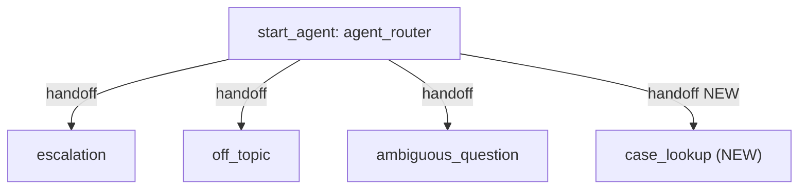

# Agent Spec — SlackAgent

## Purpose & Scope
Customer-facing Agentforce **Service Agent** (messaging channel). Routes user
requests, handles escalation to a human, and guards against off-topic /
ambiguous input. **This change adds the ability to retrieve a Case** so the
agent can answer "what's the status of my case?" type questions.

## Configuration
- **Agent type:** `AgentforceServiceAgent` (has `default_agent_user`,
  MessagingSession-linked variables, and an escalation subagent)
- **Default agent user:** `"NEW AGENT USER"` (existing placeholder in the bundle — unchanged by this task)
- **Permissions verified:** the agent user must have **Read** on `Case` for the
  new action to return data in live mode (see Notes).

## Behavioral Intent (change only)
When a user asks about a support case, the agent transitions to a new
`case_lookup` subagent, collects a **Case Number** (e.g. `00001234`), retrieves
the matching Case, and reports its key fields back as plain text. Existing
escalation / off-topic / ambiguous behavior is preserved unchanged.

## Subagent Map



All transitions are one-way handoffs via `@utils.transition to` (hub-and-spoke).
`case_lookup` has no back-transition — consistent with the existing spokes,
which also rely on the router as the re-entry point.

## Actions & Backing Logic

### `get_case` — NEEDS STUB → functional Apex
- **Backing:** new invocable Apex class `CaseLookup` (invocable) — *needs creation*
- **Target:** `apex://CaseLookup`
- **Inputs:**
  | Name | Type | Required | Notes |
  |---|---|---|---|
  | `caseNumber` | string | Yes | The Case Number the user provides (e.g. `00001234`) |
- **Outputs:**
  | Name | Type | Visible to User? | Notes |
  |---|---|---|---|
  | `caseNumber` | string | Yes | Echoed back |
  | `subject` | string | Yes | Case subject |
  | `status` | string | Yes | Case status |
  | `priority` | string | Yes | Case priority |
  | `origin` | string | Yes | Case origin |
  | `description` | string | Yes | Case description |
  | `found` | boolean | No (`filter_from_agent: True`) | Internal flag — did a Case match? |
- **Requirements:** Bulkified invocable class. `SELECT CaseNumber, Subject,
  Status, Priority, Origin, Description FROM Case WHERE CaseNumber = :caseNumber
  LIMIT 1`. If no match, return `found = false` and empty fields so the agent
  can tell the user it wasn't found. Static SOQL (runs in the agent user's
  context / user mode by default for invocable Apex).

## Variables
No new variables required. The `get_case` input is LLM slot-filled (`...`) from
the conversation, adding natural friction against action loops. Existing linked
variables (`EndUserId`, `RoutableId`, `ContactId`, `EndUserLanguage`,
`VerifiedCustomerId`) are unchanged.

## Gating Logic
- **Router → case_lookup:** LLM-chosen handoff, no `available when` gate (matches
  the other router transitions).
- **`get_case` action:** no `available when` gate needed. Loop prevention relies
  on (1) LLM slot-fill (`with caseNumber = ...`) and (2) explicit post-action
  instructions naming the output fields and telling the LLM not to re-call the
  action or use `show_command`.

## Notes / Risks
- **Live-mode permission:** if the `default_agent_user` lacks `Case` Read
  permission, the SOQL returns 0 rows silently in live preview. Verify object
  access before/while testing (`--use-live-actions`).
- The `default_agent_user` is currently the placeholder `"NEW AGENT USER"`,
  which is not a real username — publish/live-preview will require a valid
  Einstein Agent User. Out of scope for this change but will block deploy/preview.
```
